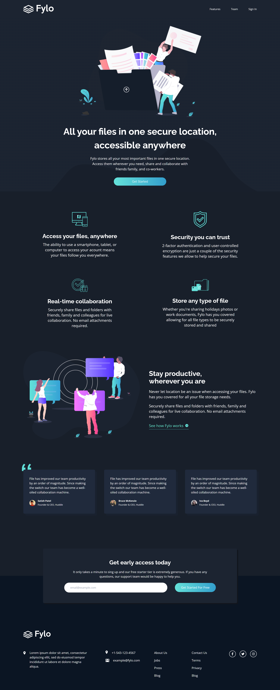

# Frontend Mentor - Fylo dark theme landing page solution

This is a solution to the [Fylo dark theme landing page challenge on Frontend Mentor](https://www.frontendmentor.io/challenges/fylo-dark-theme-landing-page-5ca5f2d21e82137ec91a50fd). Frontend Mentor challenges help you improve your coding skills by building realistic projects. 

## Table of contents

- [Overview](#overview)
  - [The challenge](#the-challenge)
  - [Screenshot](#screenshot)
  - [Links](#links)
- [My process](#my-process)
  - [Built with](#built-with)
  - [What I learned](#what-i-learned)
  - [Continued development](#continued-development)
  - [Useful resources](#useful-resources)
- [Author](#author)

## Overview

### The challenge

Users should be able to:

- View the optimal layout for the site depending on their device's screen size
- See hover states for all interactive elements on the page

### Screenshot



### Links

- Solution URL: [Add solution URL here](https://fylo-loading-page-dark-theme.netlify.app/)
- Live Site URL: [Add live site URL here](https://your-live-site-url.com)

## My process

### Built with

- Semantic HTML5 markup
- CSS custom properties
- Flexbox
- CSS Grid
- Mobile-first workflow
- Typescript
- [React](https://reactjs.org/) - JS library
- [Vite](https://vitejs.dev/) - Next Generation Frontend Tooling
- [Tailwind Css](https://tailwindcss.com/) - A utility-first CSS framework
- [React Hook Form](https://react-hook-form.com/) - Performant, flexible and extensible forms with easy-to-use validation
- [React Responsive Lib](https://www.npmjs.com/package/react-responsive) - Media queries in react for responsive design
- [React Icons](https://react-icons.github.io/react-icons/) - ES6 imports to use icons
- [React Anchor Link](https://www.npmjs.com/package/react-anchor-link-smooth-scroll) - React component for anchor links

### What I learned

- How to preconfigure utilities with Tailwind CSS.
- How to use Tailwind CSS as a tool to write clean inline CSS and use it for responsiveness.

```html
   <p className="mt-5 xlg:mt-10 sm:text-lg
   leading-snug sm:px-16 md:px-48 xlg:px-56 xlg:text-2xl">
   Fylo stores all your most important files in 
   one secure location. Access them wherever you
   need, share and collaborate with friends
   family, and co-workers.
   </p>
```
- How to insert types in Javascript using Typescript.
```js
export interface TeamType {
  profileImage: string;
  name: string;
  position: string;
  text: string;
}
```


### Continued development

I intend to focus more on the structures of the components and on aligning things more, such as making all the texts in similar proportions.

And also in improving the background-image.

### Useful resources

- [Tutorial to build a responsive website using React and Tailwind CSS](https://www.youtube.com/watch?v=I2NNxr3WPDo&t=1190s) - This helped me to structure the project and use the tools I intended to learn with the project.

## Author

- Github - [samuerikcoder](https://www.github.com/samuerikcoder)
- Frontend Mentor - [@samuerikcoder](https://www.frontendmentor.io/profile/samuerikcoder)